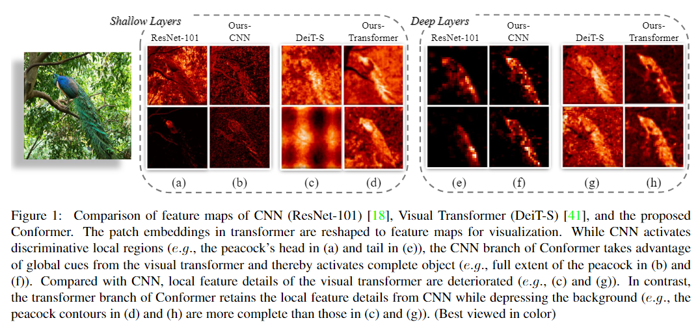
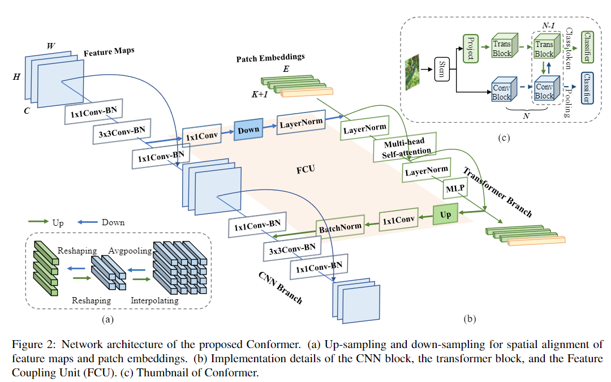
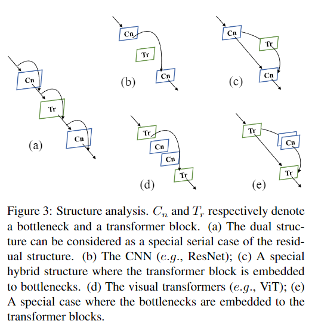
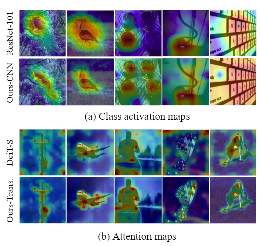
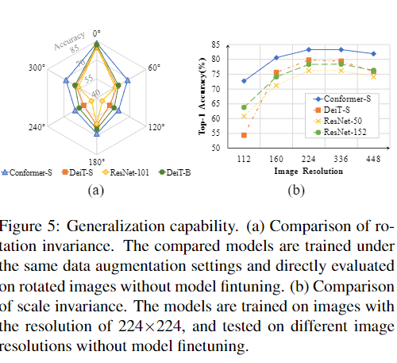
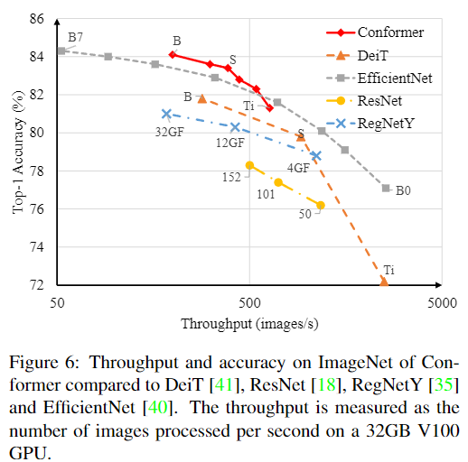

# **Conformer: Local Features Coupling Global Representations for Visual Recognition**

## 🧠 Ideia Principal
O **Conformer** é uma arquitetura híbrida que combina:
- **CNNs** (Convolutional Neural Networks) → boas para capturar *características locais*
- **Transformers visuais** → eficazes para *representações globais*

Para isso, o modelo utiliza uma unidade chamada **Feature Coupling Unit (FCU)**, que permite o intercâmbio contínuo entre as duas redes, fundindo os dois tipos de informação.

---

## 🧩 Contribuições principais
- Proposta de uma **estrutura paralela dual** (não serial) entre CNN e Transformer.
- Introdução da **Feature Coupling Unit (FCU)** para fundir características locais e globais de forma interativa.
- Resultados superiores a ResNet-101 e DeiT-B em tarefas de classificação, detecção e segmentação.

---

## 📈 Desempenho
- **ImageNet (Top-1 Accuracy)**:
  - ResNet-101: 77.4%
  - DeiT-B: 81.8%
  - **Conformer-B**: **84.1%**

- **MS COCO (Detecção e Segmentação)**:
  - Melhor desempenho que ResNet-101 com menos parâmetros e FLOPs.

---

### 📷 Figura 1 — Visualização de Ativações
Compara mapas de ativação entre:
- CNN (ResNet-101),
- Transformer (DeiT-S),
- **Conformer (CNN e Transformer branches)**

➡️ Demonstra que o Conformer consegue ativar regiões **mais completas** dos objetos, preservando tanto **detalhes locais** quanto **contexto global**.

---

### 🧱 Figura 2 — Arquitetura do Conformer
- Mostra como as branches CNN e Transformer são organizadas.
- O FCU conecta ambas via **downsampling/upsampling**, **1x1 convoluções**, e **normalizações**.

---

### 🔍 Figura 3 — Análise Estrutural
Apresenta diferentes formas de combinar CNNs e Transformers, destacando que o Conformer **integra melhor** do que abordagens híbridas anteriores.

---

### 🧠 Figura 4 — Mapas de Atenção e Ativação
- Ativações mais amplas e detalhadas nas imagens.
- **Transformers sozinhos perdem detalhes locais**; Conformer resolve isso.

---

### 📐 Figura 5 — Invariância
- **Invariância à rotação** e **escala** testadas.
- Conformer mostra robustez maior do que ResNet e DeiT.

---

### ⚡ Figura 6 — Desempenho x Velocidade
- **Conformer** oferece melhor precisão mantendo **boa taxa de throughput** em relação a ResNet, DeiT e EfficientNet.

---

### 📊 Tabelas Relevantes
- **Tabela 2**: Desempenho em ImageNet.
- **Tabela 3**: Desempenho em detecção e segmentação (MS COCO).
- **Tabela 4**: Variações de parâmetros e acurácia.
- **Tabela 8**: Comparação com modelos ensembles.

---

## 📌 Conclusão
O **Conformer** representa um avanço significativo ao unir o melhor das CNNs (detalhes locais) com Transformers (contexto global) por meio de uma arquitetura dual e interativa. Apresenta alto desempenho em várias tarefas visuais, com bom custo computacional.

🔗 Código disponível: [github.com/pengzhiliang/Conformer](https://github.com/pengzhiliang/Conformer)