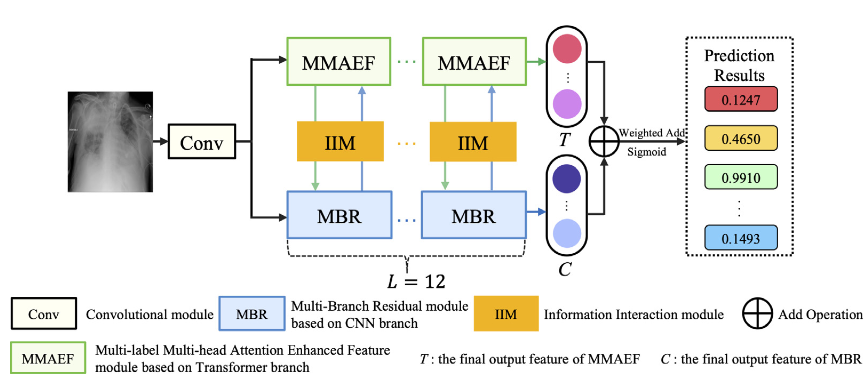
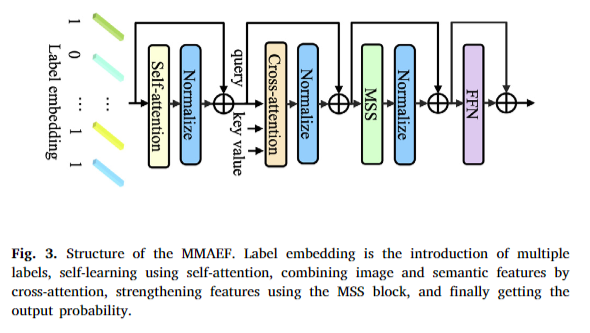
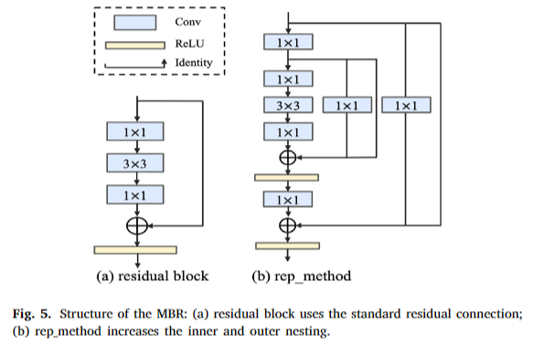
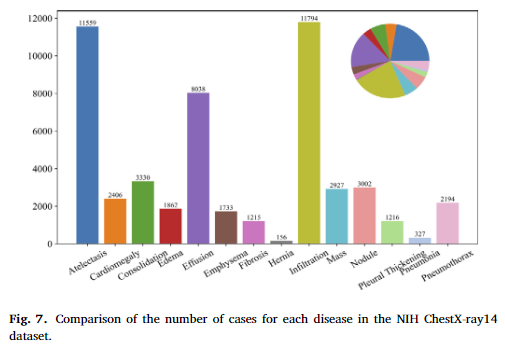
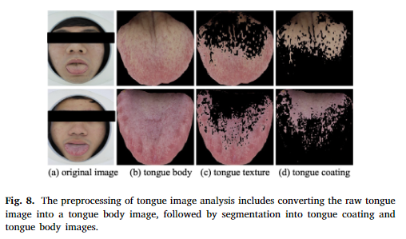
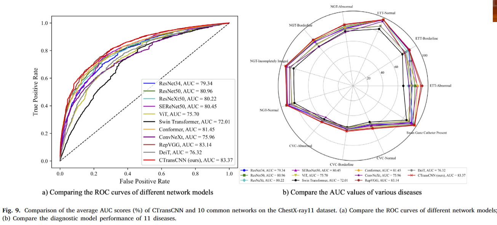
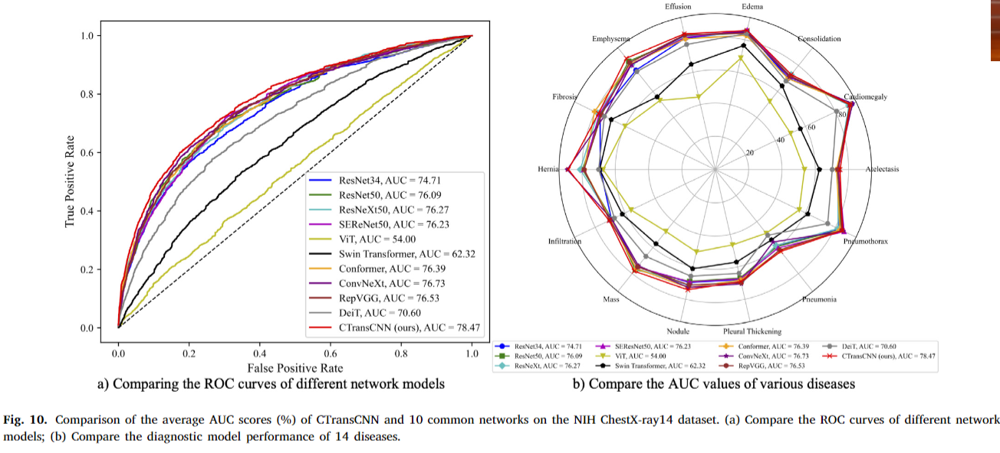

# CTransCNN - Combinação de Transformer e CNN na Classificação Multirrótulo de Imagens Médicas

## 🎯 Objetivo
Apresentar um modelo híbrido chamado **CTransCNN**, que combina *CNN* e *Transformer* para melhorar a classificação de imagens médicas com múltiplos rótulos (multilabel), lidando com problemas de:
- Correlação entre rótulos;
- Desequilíbrio de classes;
- Distribuição espacial extensa das lesões.

---

## 🧠 Estrutura do Modelo CTransCNN

### Componentes principais:
- **MMAEF** (Multilabel Multihead Attention Enhanced Feature): Explora relações entre rótulos.
- **MBR** (Multibranch Residual): Otimiza o aprendizado de características com conexões residuais aninhadas.
- **IIM** (Information Interaction Module): Permite troca de informação entre CNN e Transformer com caminhos bidirecionais (C2T e T2C).

 
*(Ajuda a visualizar como as partes CNN, Transformer e IIM se integram.)*

---

## 🔍 Inovações Técnicas

- **Arquitetura Paralela**: CNN e Transformer trabalham em paralelo com interações contínuas.
- **Cross-attention com Embeddings de Rótulos**: Permite que rótulos raros tenham mais atenção.
- **Perda Multirrótulo personalizada**: Combinação entre Focal Loss e Asymmetric Loss com otimização baseada na teoria de Pareto.

---

## 🧪 Experimentos e Resultados

### 📊 Bases de Dados Utilizadas
- **ChestX-ray11**: 30.083 imagens com 11 classes.
- **NIH ChestX-ray14**: 112.120 imagens com 14 classes.
- **TCMTD**: 1.019 imagens de língua para diagnóstico segundo a Medicina Tradicional Chinesa (MTC).

### 📈 Desempenho
- CTransCNN superou modelos como ResNet, ViT, Swin Transformer e RepVGG em **mAP** e **AUC** nas três bases de dados.
- Média AUC:
  - **ChestX-ray11:** 83.37%
  - **NIH ChestX-ray14:** 78.47%
  - **TCMTD:** 87.46%

---

## 📌 Conclusões

- O **CTransCNN** oferece uma solução robusta e generalizável para tarefas complexas de classificação de imagens médicas multirrótulo.
- A interação entre CNN e Transformer via módulos dedicados melhora a extração e interpretação de características.
- Pode ser estendido para outras áreas da medicina, além de radiografias e análise de língua.

---

## 📚 Abreviações Importantes

| Sigla | Significado |
|-------|-------------|
| CNN | Convolutional Neural Network |
| ViT | Vision Transformer |
| MMAEF | Multilabel Multihead Attention Enhanced Feature |
| MBR | Multibranch Residual |
| IIM | Information Interaction Module |
| C2T | CNN-to-Transformer |
| T2C | Transformer-to-CNN |
