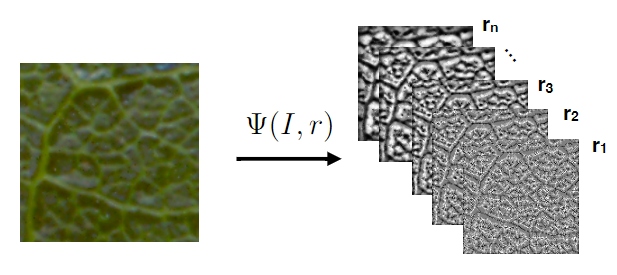
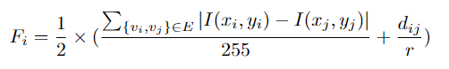
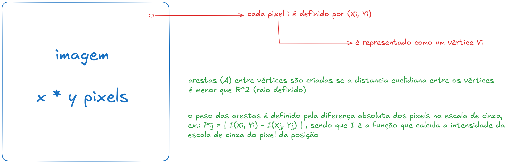
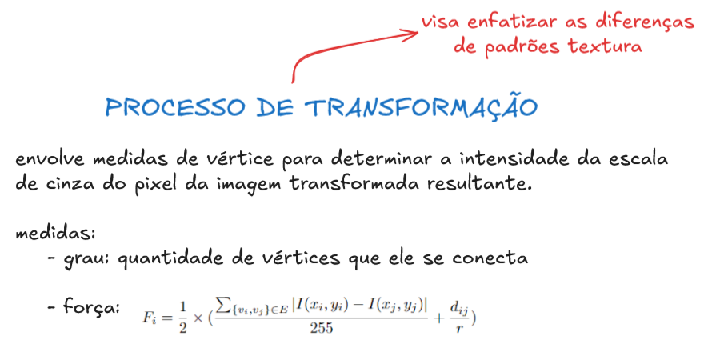

# CNIT: Complex Network Image Transform

utiliza técnicas de modelagem de redes complexas para representar a imagem de entrada.

a imagem é modelada como um grafo complexo, onde cada pixel é transformado em um vértice, e as arestas são definidas com base na conectividade de vizinhança de raio r.

I é uma imagem onde os pixels i = (xi, yi)

cada pixel i é mapeado como um vértice vi ∈ V e dois vértices são conectados por uma aresta se a distância euclidiana entre eles é menor que o raio r.

então, as arestas são A = {{vi, vj} | vi, vj ∈ V, i != j e (xi - xj)2 + (yi - yj)2 < r2 }

o peso das arestas é dado pela diferença absoluta nos níves cinzas da correspondência de pixels, isto é, o peso de um aresta conectando vi e vj é wij = |I(xi, yi) - I(xj, yj)|. onde I(xi, yi) e I(xj, yj) são a escala cinza de intensidade de valores dos pixels i e j, respectivamente.

essa abordagem consiste em transformar o complexo modelo de rede em novas imagens que enfatizem diferentes padrões de textura a partir da imagem original codificada dentro da topologia de rede.

exemplo:

o processo de transformação envolve mapear medidas de vertices, grau e força, para intensidade de valores de pixel, resultando em imagens que encapsulem os padrões de texto subjacentes. 

o grau de um vertice representa o número de conexões que ele tem com outros vertices.

a força é calculada com a combinação de dois fatores:
- a diferença normalizada na escala cinza de intensidade entre vi e todos os outros vértices conectados
- distância euclidiana entre os vertices conectados

sendo dij a distancia euclidiana entre os pixels (xi, yi) e (xj, yj) e o r é o raio usado para definir os vizinhos.

os padrões de textura resultantes são influenciados pelo parametro r (raio de conexão), o qual controla a representação estrutural da rede. variando o r, o método capture diferentes escalas de informação de texturas, permitindo analisar micro e macro padrões de textura.

---

### imagens de resumo ;)

