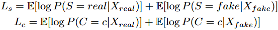

# **GAN-based Synthetic Medical Image Augmentation for Increased CNN Performance in Liver Lesion Classification**

Maayan Frid-Adar, Idit Diamant, Eyal Klang, Michal Amitai, Jacob Goldberger, Hayit Greenspan  
Tel Aviv University, The Chaim Sheba Medical Center, Bar-Ilan University (Israel)

---

## Palavras-chave
GAN, *Data Augmentation*, CNN, Lesões Hepáticas, Classificação Médica, Imagens Médicas Sintéticas  

---

## Abstract

- present methods for generating synthetic medical images using GANs
- show that it can be used for synthetic data aug and improve the perfomance of CNN 
- dataset of computed tomography images of 182 liver lesions (lesões hepáticas)
- first exploit GAN architectures for synthesizing high quality liver lesion ROIs (Regions of Interest)
- then present a scheme for liver lesion classification using CNN
- then, train the CNN using classic data aug and our synthetic data aug

---

## Introduction

- most common data aug methods: translation, rotation, flip and scale
- GANs gained popularity for generating high quality images
- medical image applications have applied GAN, most studies employed the image-to-image technique to create label-to-segmentation translation, segmentation-to-image translation or medical cross modality translation (section #1 of studies)
- in this work, its used CNNs for classification 
- contributions of the work:
  1. synthesis of high quality focal liver lesions from CT images using generative adversarial networks (GANs)
  2. desing of a CNN-based solution for the liver lesion classification task, with comparable results to state-of-the-art methods
  3. augmentation of the CNN training set, using the generated synthetic data

---

## Liver Lesion Classification

#### *Data*
- dataset made of 182 CT scans (53 cysts, 64 metastases, 65 hemangioma)
- liver lesions vary in shape, contrast and size (10 - 102mm)
- each type of lesion has its characteristics, but metastasis and hemangioma lesions may be 
confusing
- the input to our classification system are ROIs of lesions cropped from CT scans

#### *CNN Architecture* 
- fixed size input ROIs of 64x64
- intensity range to (0,1)
- three pairs of convolutional layers where each conv layer is followed by a max-pooling layer and two dense fully-connected layers, ending with a soft-max layer to determine the predictions to classify
- ReLu as activation functions
- to reduce overfitting they incoporate a dropout layer with probability of 0.5 during training

> **training procedure**: the mean value of the training images was substracted from each image fed into the CNN. for training we used a batch size of 64 with a learning rate of 0.001 for 150 epochs. they used stochastic gradient descent optimization  

#### *Generating Synthetic Liver Lesions*

they augmented in two ways:
1 - classic ways (cited above)
2 - synthesis of new examples using generative models

##### A. *Classic Data Augmentation*

even in small CNN there is the danger of overfitting.
classic techniques: translation, rotation, scaling and flipping.

each lesion ROI:
1) *N~rot~* times at random angles $\theta$ = [0°,...,180°]
2) flipped *N~flip~* times (up-down, left-right)
3) translated *N~trans~* times where we sampled random pair of [x,y] pixel values between (-p, p) related to the lesion diameter (d) by *$p = min(4, 0.1 * d)$*
4) ROI was scaled *N~scale~* times from a range of scales *$s = min(0.1 * d, 0.4 * d)$*

**total number of augmentation** was *N = N~rot~ X (1 + N~flip~ + N~trans~ + N~scale~)*

example of augmentation:

all the ROIs was resized to fit a uniform size of 64x64 pixels using bicubic interpolation

##### B. *Generative Adversarial Networks for Lesion Synthesis*

the generative model aims to learn the data distribution *p~data~* from a set of samples to further generate new samples from the learned distribution. 

they explored two variantes of GANs for synthesizing labeled lesions: DCGAN and ACGAN. one that generates labeled examples for each lesion class separately and the other that incorporates class conditioning to generate examples all at once.

they started with DCGAN (followed Radford architecture, where G and D are deep CNNs). the model consists of two neural networks that are trained simultaneously. 

*looking the img*: discriminator (D) receives a sample *x* and outputs *D(x)* that is the probability of beign a real sample. generator (G) gets input samples from a simple distribution *p~z~* and maps *G(z)* to the image space of distribution *p~g~*, the goal of G is to achive *p~g~ = p~data~*.

adversarial networks are trained by optimizing the following loss function of a two player minimax game:

the D is trained to maximize *D(x)* for images with *$x \sim p_{data}$* and to minimize D(x) for images with *$x \nsim p_{data}$*. the G produces images to fool D during training, such that *$D(G(z)) \sim p_{data}$*, so it aims to maximize D(G(z))

**generator architecture**: it takes a vector of 100 random numbers (drawn from a uniform distribution as input) and outputs and a liver lesion image of size 64x64x1 (shown in figure below). the network consists of a fully connected layer 4 x 4 x 1024 and four *fractionally-strided convolutional* layers ("deconvolution" -> expands the pixels by inserting zeros in between them) to up-sample the image with a 5 x 5 kernel size. batch-normalization is applied to each layer, except for the output layer. normalizing responses to have zero mean and unit variance stabilizes the GAN learning and prevents collapsing all samples to a single point. ReLU activation functions are applied to all layers except the output layer (uses tanh act fun)

**discriminator architecture**: has a typical CNN architecture, with input image of size 64 x 64 x 1 and outputs a decision. the networks consist of four convolution layers with a kernel size of 5 x 5 and a full connected layer. strided convolutions are applied to each convolution layer to reduce spatial dimensionality instead of using pooling layers. batch-normalization is applied to each layer, except the input and output. leaky ReLU are applied to all except the output layer (uses Sigmoid function).

**training procedure**: they trained the DCGAN to synthesize liver lesion ROIs for each lesion category separately. they used mini-batches of m=64 lesion ROI examples ${x_l}^{(1)}, \dots, {x_l}^{(m)}$ for each lesion type $ l \in (Cyst, Metastasis, Hemangioma)$ and m=64 noise samples $z^{(1)}, \dots, z^{(m)}$ drawn from uniform distribution between [-1, 1]. leaf of leaky ReLU was set to 0.2. weights were initialized to a zero-centered normal distribution with standard deviation of 0.02. learning rate of 0.0002 for 70 epochs.

##### C. *Conditional Lesion Synthesis*

the second variant of the GAN is the Auxiliary Classifier GAN (ACGAN). the conditional nature enable the model to be conditioned on external information to improve the generation quality. the discriminator contains an auxiliary decoder that outputs the class label. the generator has the class embedding in addition to the input noise samples. the ACGAN discriminator modified the DCGAN to have kernels of size 3x3 with strided convolutions every odd layer and incorporates a dropout of 0.5 in every layer except for the last layer.

**training procedure**: are equal to the other described, except that the learning rate is 0.0001 for 50 epochs. the training inputs is a pair of (liver lesion ROI, corresponding labels), like $(x_{l}, y_{l})^{(1)}, \dot, (x_{l}, y_{l})^{(m)}$ for all lesion types $ l \in (Cyst, Metastasis, Hemangioma)$ and noise samples $z^{(1)}, \dots, z^{(m)}$ drawn from uniform distribution between [-1, 1]. 

basic GAN discriminator maximization is the image below, where $ P(S|X) = D(X) $ and $X_{fake} = G(z)$.

the discriminator outputs $P(S|X)$, $P(C|X) = D(X)$ and $X_{fake} = G(c, z)$ where C is the class label. the loss has two parts:

the discriminator is trainde to maximize $ L_{s} + L_{c} $ and the generator is to maximize $ L_{c} - L_{s} $.

---

## Studies

#### #1 translations

> *"most studies employ the image-to-image technique to create label-to- segmentation ranslation, segmentation-to-image translation or medical cross modality translations"*

##### image-to-image translation
- é a tarefa de transformar uma imagem de um domínio (tipo, estilo, representação) para outro domínio usando redes neurais
- é tipo um "filtro" de foto, transformando uma foto de dia em uma de noite

##### label-to-segmentation translation
- label é a representação simples (grosseira), ex.: mapa binário, conjunto de pontos chaves, contorno muito básico, máscara de baixa qualidade/resolução
- segmentação é a representação detalhada, é uma máscara onde cada pixel é classificado (ex.: este é vaso sanguíneo, este é tecido saudável...)
- o médico criar labels simples e o GAN faz a segmentação complexa *"pixel-perfect"*

##### segmentation-to-image translation
- transforma a segmentação em uma imagem realista
- por que é util?
  - gerar imagens sintéticas realistas para treinar outros modelos quando dados reais são escassos
  - verificar se a segmentação gerada faz sentido anatomicamente quando convertida para imagem

##### medical cross modality translations
- modalidade é o tipo de exame (ressonancia magnetica, tomografia, raio-X, ultrassom...) e cada uma representas os tecidos de uma forma diferente
- tradução cruzada é transformar uma imagem da modalidade X em uma imagem da modalidade Y
