# Color-texture classification based on spatio-spectral complex 

## resumo

propõe um método para análise de textura coloridas por aprendizado de representações _spatio-spectral_ a partir de um rede complexa utilizando RNN (Randomized Neural Network).

modela-se a imagem como uma rede complexa baseada no modelo SSN (_Spatio-Spectral Network_), que considera conexões na topologia para representar as características espaciais e padrões espectrais.

insight: características topológicas complexas da SSN podem ser incorporadas por um modelo de rede neural simples e rápido para a classificação de texturas coloridas.

investiga-se como utilizar efetivamente a RNN para analisar/representar os padrões espaciais/espectrais a partir da SSN.

utilizam medidas de vértices da SSN para treinar a RNN para prever as dinamicas da evolução de um rede complexa e adotar os pesos aprendidos para da camada de saída como descritores.

obteve resultados melhores que vários da literatura, incluindo _deep convolutional neural networks_. 

ótimo para reconhecimento de espécies de planta.

---

## 🎯 Objetivo
Propor um método de análise de textura em imagens coloridas combinando:
- **Modelagem de redes complexas** (Spatio-Spectral Networks - SSN)
- **Redes neurais aleatórias** (Randomized Neural Networks - RNNs)

Essa fusão permite capturar e aprender padrões **espaciais e espectrais** com alta discriminação e baixo custo computacional.

---

## 🔧 Metodologia

### 1. Spatio-Spectral Network (SSN)
- Representa uma imagem colorida como uma rede complexa:
  - **Cada pixel** é um vértice.
  - **Arestas** conectam pixels com base em:
    - **Distância espacial** (raios `r`)
    - **Diferença de intensidade entre canais de cor** (opponent color modeling).
- Arestas são dirigidas conforme o gradiente de intensidade.

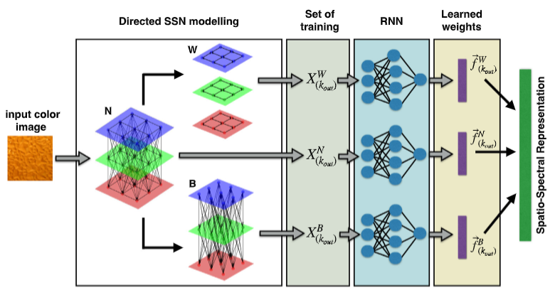
📷 **Fig. 1** – Processo geral da modelagem SSN e entrada da RNN.

---

### 2. Randomized Neural Network (RNN)
- Utiliza pesos aleatórios na camada escondida.
- Treina apenas a camada de saída (via pseudo-inversa).
- A saída da RNN se torna a **representação da textura**.

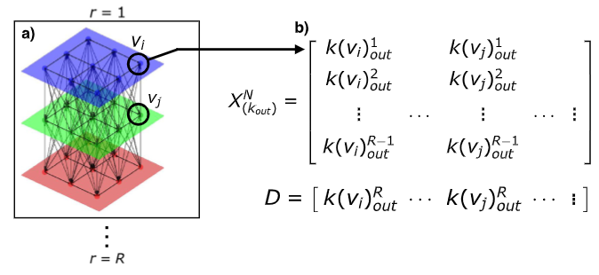
📷 **Fig. 3** – Construção das entradas para a RNN usando graus de saída em diferentes raios.

---

### 3. Extração de Medidas
São calculadas para três redes derivadas:
- `N`: conexões completas
- `W`: conexões dentro do mesmo canal
- `B`: conexões entre canais

Medidas topológicas:
- Grau de saída (out-degree)
- Força de saída (out-strength)
- Força de entrada (in-strength)

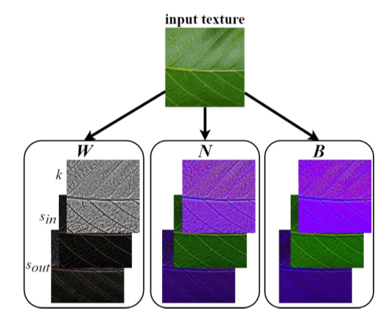
📷 **Fig. 2** – Visualização das medidas em tons de cinza.

---

### 4. Representação Final (SSR)
- Combina os vetores aprendidos de cada rede (N, W, B) e medida (grau, força in/out).
- Cria representações multiescalares a partir de diferentes `r` e `Q` (neurônios escondidos).

---

## 📊 Experimentos

### Bases utilizadas:
- **Outex**, **USPTex**, **MBT**, **CUReT** (diversidade de texturas e condições)

### Avaliações:
- Testes com diferentes `R` e `Q`.
- Avaliação da robustez à **rotação** e ao **ruído sal e pimenta**.
- Comparação com:
  - **Métodos tradicionais** (GLCM, Gabor, LBP, etc.)
  - **Deep CNNs** (AlexNet, VGG, ResNet, Inception)
  - **Métodos baseados em redes complexas** (SSN, MCND, CNTD)

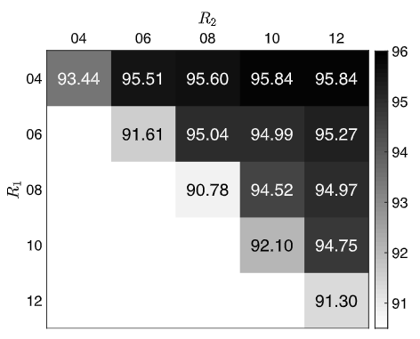
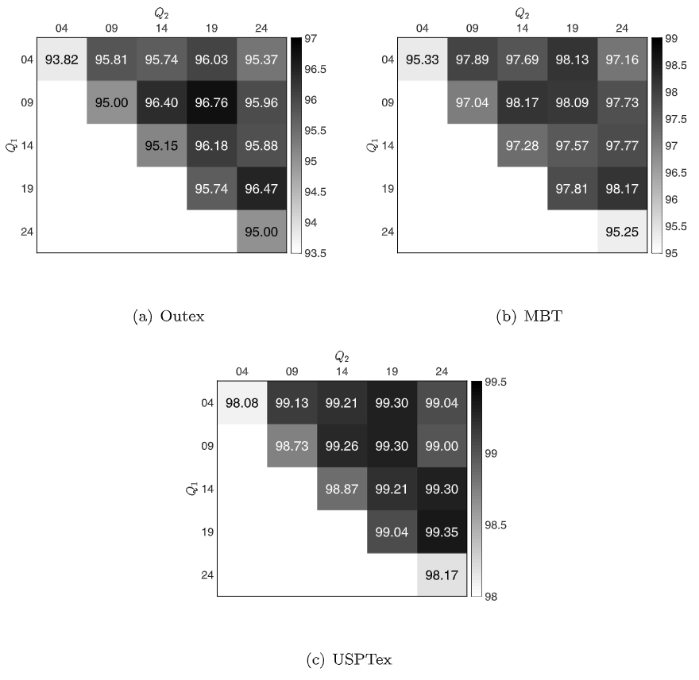
📷 **Fig. 4 & 5** – Acurácia em diferentes combinações de parâmetros  

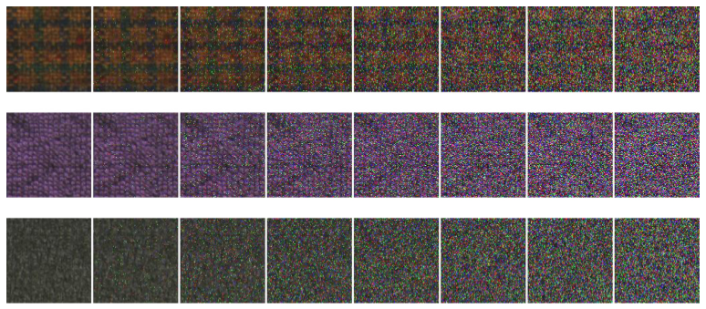
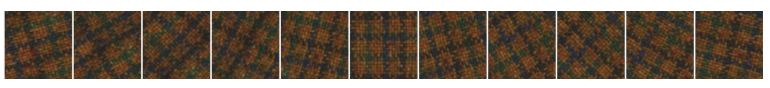
📷 **Fig. 6 & 7** – Tolerância ao ruído e rotação 

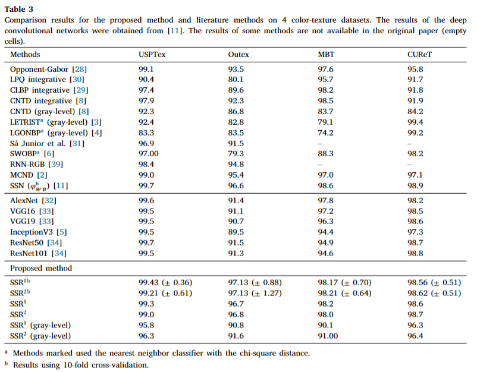
📷 **Tabela 3** – Comparação com outros métodos

---

## 🌿 Aplicação: Reconhecimento de Espécies Vegetais
- Utilizou texturas de folhas de 20 espécies brasileiras.
- SSR1 obteve 96.25% de acurácia (superior a todos os métodos comparados).

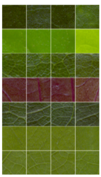
📷 **Fig. 8** – Exemplos de janelas extraídas de folhas

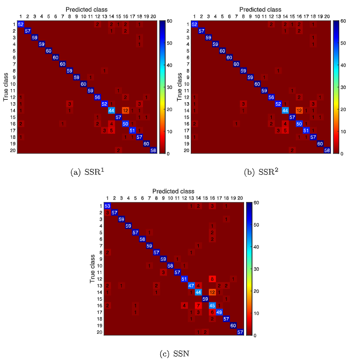
📷 **Fig. 9** – Matrizes de confusão para SSR e SSN  

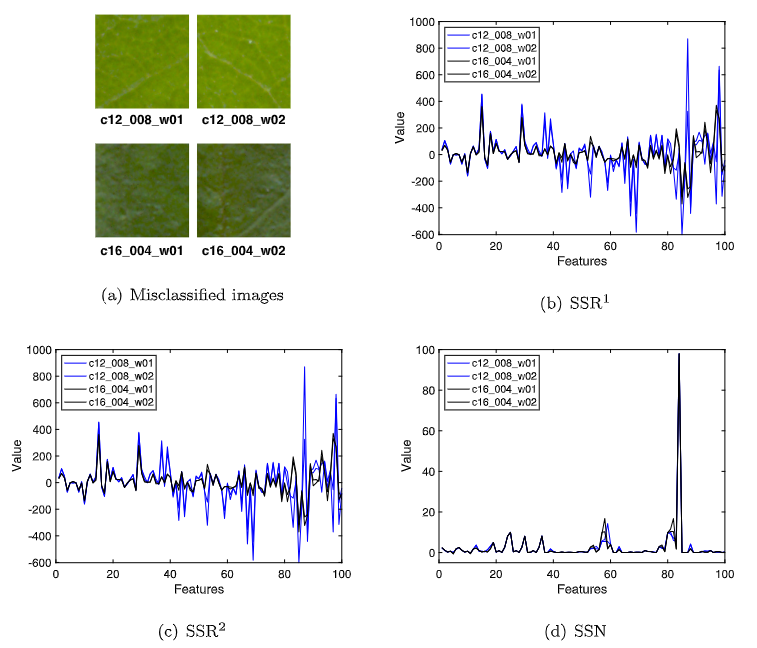
📷 **Fig. 10** – Comparação visual entre representações aprendidas

---

## 🧮 Complexidade Computacional
- Modelagem SSN: 𝑂(𝑁𝑝 · R)
- RNN: 𝑂(𝑁) onde `N` = número de vetores de entrada
- Mais eficiente que CNNs, especialmente para aplicações com recursos limitados.

---

## ✅ Conclusão
- O método proposto apresenta:
  - Alta acurácia
  - Robustez à rotação e ruído
  - Baixo custo computacional
- Promissor para aplicações reais, como identificação de plantas e análise multiespectral.