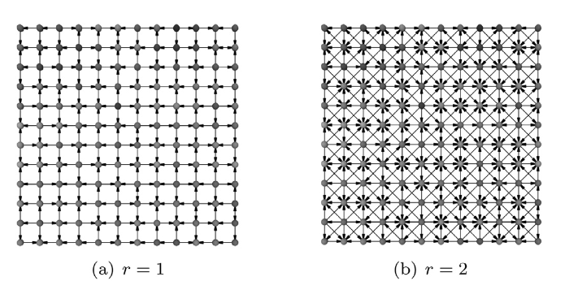
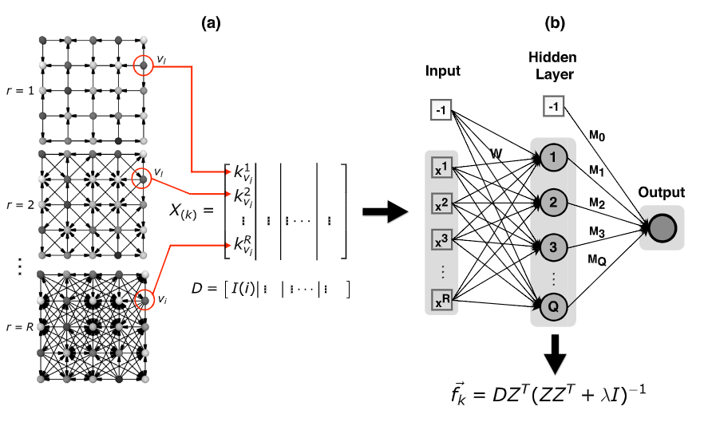
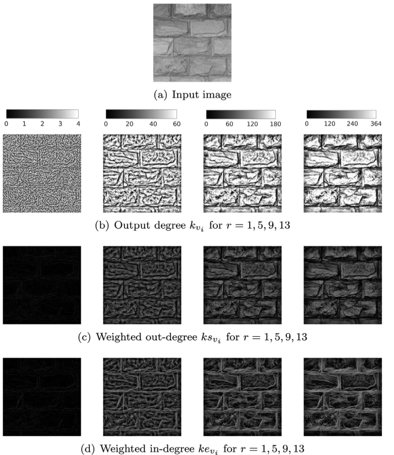
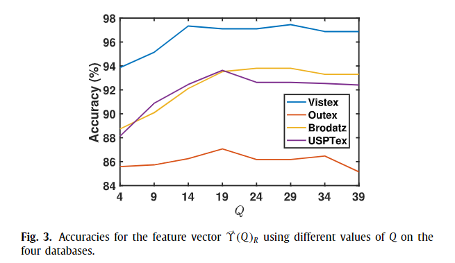
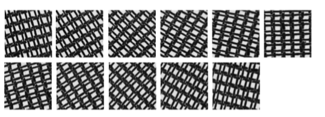
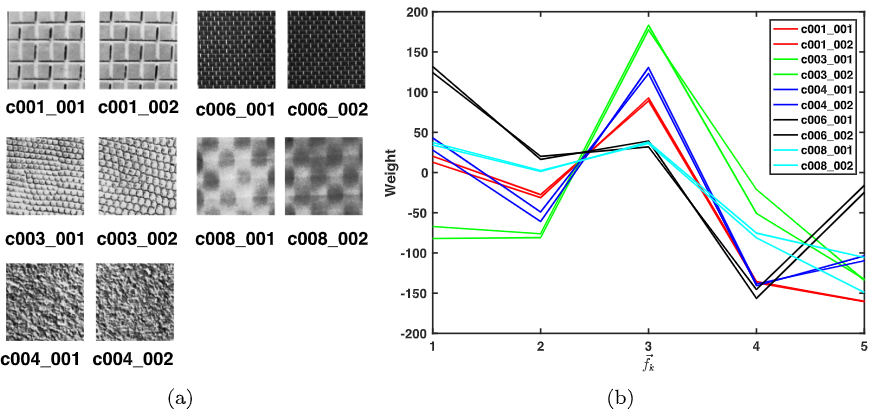
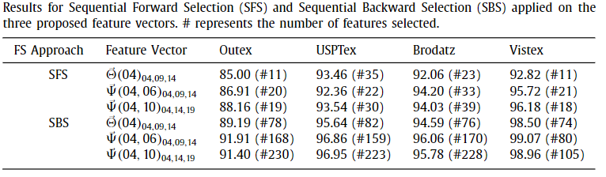

# Fusion of Complex Networks and Randomized Neural Networks for Texture Analysis

## 🔍 Objetivo
Propor um método de alta acurácia para análise de texturas, unindo:
- **Redes complexas** (complex networks - CN) como modelagem da imagem.
- **Redes neurais aleatórias** (randomized neural networks - RNN) como extrator de características.

---

## 🧠 Fundamentos

### Complex Networks
- Modelam pixels como vértices e relações de intensidade/distância como arestas dirigidas.
- Permite representar propriedades estruturais da textura.
- Medidas extraídas:
  - Grau de saída (out-degree)
  - Grau de saída ponderado
  - Grau de entrada ponderado

📷 *Fig. 1* — Redes complexas com diferentes raios `r`.

---

### Randomized Neural Networks (RNN)
- Redes com pesos aleatórios na camada escondida.
- Apenas os pesos da saída são treinados (via pseudo-inversa).
- O vetor de pesos da saída é a **assinatura da textura**.

  
📷 *Fig. 2* — Construção do vetor de entrada a partir de diferentes `r`.

---

## 🔧 Método Proposto

1. Modela imagem como rede complexa para vários valores de raio `r`.
2. Calcula medidas topológicas por pixel.
3. Treina RNN com essas medidas; a saída é usada como vetor de características.
4. Gera vetor final concatenando saídas de RNNs para diferentes `r` e diferentes quantidades de neurônios `Q`.

📷 *Fig. 6* — Visualização das medidas em tons de cinza para diferentes `r`.

---

## 📊 Experimentos

### Bases Utilizadas
- **Brodatz** (1776 imagens)
- **Outex** (1360 imagens)
- **USPTex** (2292 imagens)
- **Vistex** (864 imagens)

### Resultados
- Superou métodos clássicos como GLCM, LBP, Gabor, LPQ, entre outros.
- Obteve melhores acurácias em quase todos os cenários, inclusive em texturas rotacionadas.

📷 *Fig. 3* — Acurácias para diferentes valores de Q.  

📷 *Fig. 5* — Exemplos de rotação (robustez do método).  

📷 *Fig. 7* — Vetores de características extraídos de amostras da Brodatz.

---

## ⚙️ Desempenho

- Boa relação entre acurácia e tempo de processamento.
- Tempo médio por imagem: de **0.11s** a **0.46s**, dependendo do vetor usado.
- Resistente à rotação (rotated Brodatz, Outex e Vistex).

---

## ✂️ Seleção de Atributos

- Foram testadas técnicas de **SFS** (forward) e **SBS** (backward).
- Mesmo com vetores reduzidos, o método manteve boa performance.

📷 *Tabela 7* — Comparação entre vetores reduzidos (com seleção de atributos).

---

## ✅ Conclusão

- A fusão entre redes complexas e RNNs é altamente eficaz para **análise de texturas**.
- O método é:
  - Discriminativo
  - Eficiente
  - Robusto à rotação
- Excelente alternativa para aplicações em visão computacional.