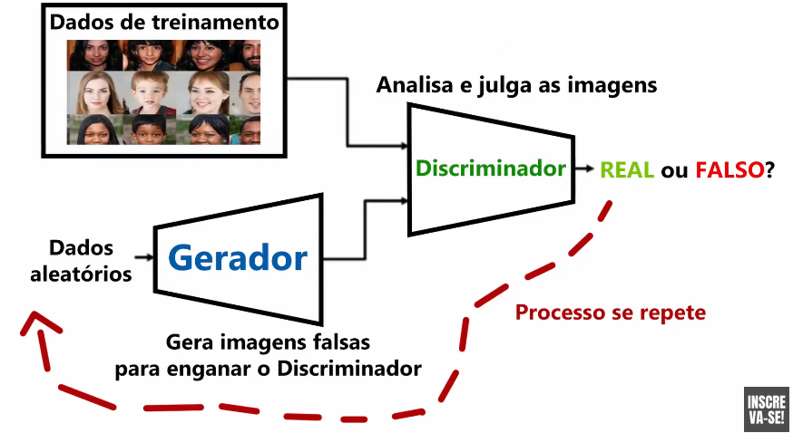

# GANs (Generative Adversarial Networks)

## versatilizando (yt)

### o que são?
são arquiteturas de redes neurais compostas por duas redes, que são colocadas uma contra a outra.

### como funciona?

gerador cria as imagens.

discriminador analisa as imagens com base nas imagens reais e julga como aceitável ou não, e assim se repete infinitamente.

de acordo com o "feedback", o gerador altera seu comportamento visando gerar imagens que "enganem" o discriminador.

### casos de uso

- obras de arte
- criação de imagens de pessoas
- NVIDIA fez algoritmo para criar imagens a partir de uma só, tendo angulos diferentes do mesmo objeto