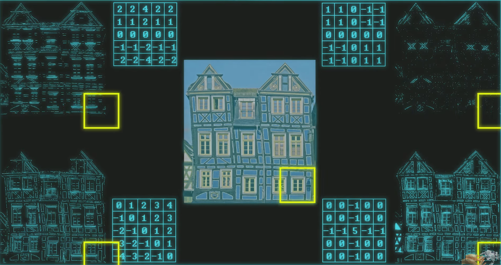

# Convolutional Neural Networks

## futurology (yt)

### example of number recognization

PhD of some university.

we have three big parts
- input
- processing space 
- output

### input

its the image pixels.
 
digital camera has three channels (RGB).

RGB is three 2D matrix stacked upon one another (for the sake of simplicity).

in this study, we will use the image with only one channel, filled with the values from 0 to 255 (8 bits).

### processing space

this area has 6 parts in this example.

they appear at this sequence
- conv
- pool
- conv
- pool
- fc
- fc

#### 1st convolutional layer

the name is got from the convulitional operator, that is a mathematical combination, in other words, the dot product of two functions to produce a third function.

in CNN, this operations is implemented by a feature detector / filter / kernel.

a kernel is a mini matrix, orders of magnitude smaller than the input image.

on a conv op, the kernel moves across the input image, taking the dot product of the two matrices and then saving the values to a new matrix, called the feature map of the original image.

" how this is able to detect any features at all? "
if the kernel is initialized with a specific configuration, they can be used to transform an input image and find various patterns.

for example, it can be used kernels that are edges detectors (one detect horizontal edges and other vertical edges).

example of four kernels that focus on four types of edges.

in the video, it shows using six kernels for each input.

#### 1st pooling

extract the main caracteristics, it downsample the feature map.

its a max pooling.

#### 2nd conv layer

has 16 kernels in this layer.

#### 2nd pool

max pooling again.

#### resume from 1st conv ~ 2nd pool

input 32x32 (1024 pixels)

conv1 6x28x28 (4704 pixels)

pool1 6x14x14 (1176 pixels)

conv2 16x10x10 (1600 pixels)

pool2 16x5x5 (400 pixels)

this process is reffered as "Feature Extraction".

the next part of the process is the classifier.

#### fully connected layers 

in this example, there is 120 neurons in the first fully connected layer and 100 in the second

### output