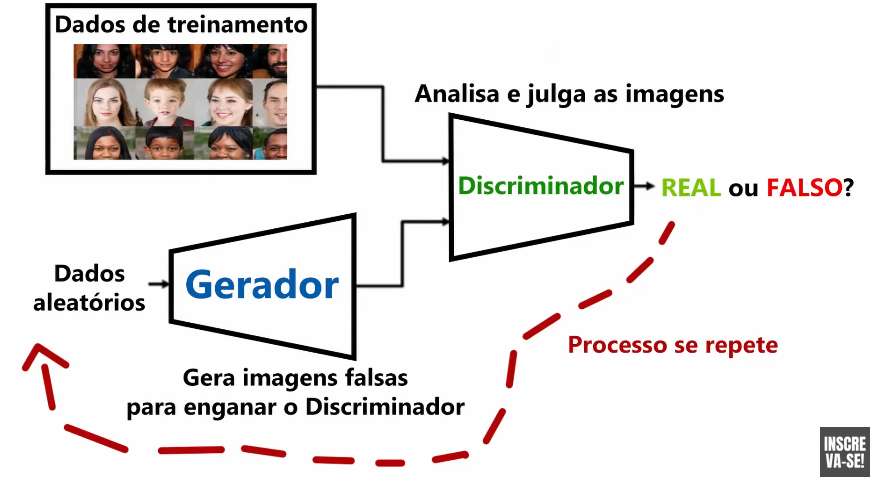

# GANs (Generative Adversarial Networks)

## Versatilizando (yt)

### o que são?
são arquiteturas de redes neurais compostas por duas redes, que são colocadas uma contra a outra.

### como funciona?

gerador cria as imagens.

discriminador analisa as imagens com base nas imagens reais e julga como aceitável ou não, e assim se repete infinitamente.

de acordo com o "feedback", o gerador altera seu comportamento visando gerar imagens que "enganem" o discriminador.

### casos de uso

- obras de arte
- criação de imagens de pessoas
- NVIDIA fez algoritmo para criar imagens a partir de uma só, tendo angulos diferentes do mesmo objeto

---

## IBM (yt)

ele coloca dois modelos de IA um contra o outro

### aprendizado supervisionado

input_data -> model -> output

entao comparamos o output com o esperado output, e baseado nisso descobre-se como atualizar o modelo pra ter melhores resultados.

### aprendizado não supervisionado

> o GAN é um!!

temos dois submodelos: generator e descriminador.

o gerador gera exemplos fake (fake samples) e o descrminador tem que decidir se é um dado falso ou não (é pertencente ao dominio).

### onde que entra a geração de imagens?

exemplo de como funciona criando fake flowers.

nosso dominio seria varias fotos de flores e o modelo descriminador será treinado em cima disso, e quando ele ficar bom em reconhecer flores o gerador começa a gerar imagtens falsas.

o gerador vai receber um vetor aleatório de entrada e ira usar isso pra criar as proprias flores, a qual é mandada ao descriminador, este que decide se é falso ou não.

baseado na resposta, o gerador, ou descriminador, irão mudar seu comportamento.

#### CNNs

no campo de imagens, o gerador e descriminador são frequentemente implementados com CNNs

### casos de uso

- predição de cenas (dado a cena x, qual sera a cena seguinte à x)

- aprimoramento de imagens (aumentar a resolução)

- criptografia tambem

---

## AssemblyAI (yt)

video of building a GAN from scratch: https://www.youtube.com/watch?v=_pIMdDWK5sc

GANs learn to generate new data with the same statistics as the training set.

GANs consist of 2 networks playing an adversarial game against each other.

### generator vs discriminator

you already know each paper 😉

gen and disc are randomly initialized in the begining, and then trained simultaneously

we have to minimize 2 losses (2 optimizer) and use BCE loss.
> 🔎 **search about this!!!** 🚨

---

## Pytorch Lightnin basic GAN tutorial

link: https://lightning.ai/docs/pytorch/stable/notebooks/lightning_examples/basic-gan.html
